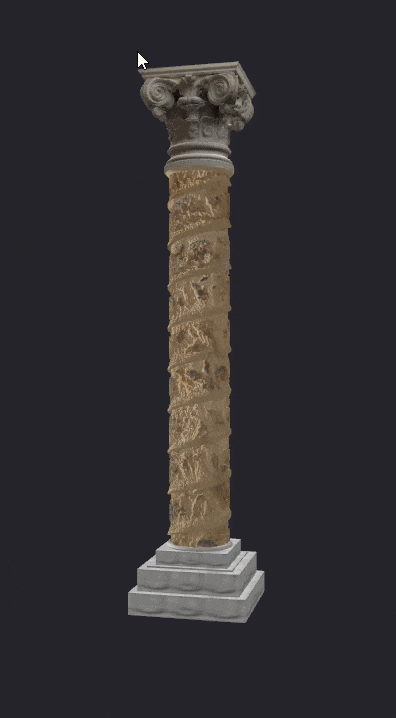

# Joshua Roll Column Simulation

Procedural 3D reconstruction workflow for wrapping the [Joshua Roll](https://en.wikipedia.org/wiki/Joshua_Roll) imagery onto a triumphal column, as was originally intended.

## Intro 
The Joshua roll is a piece of artwork from the 10th century, about 10m long and 30cm high. It's supposed to represent Joshua's campaign in the holy land, but probably a copy of an earlier work referring to Heraclius' campaign in the Roman-Sassanid war of 602 to 628. 

I heard about it in James Howard-Johnston's "The Last Great War of Antiquity" where it was mentioned alongside a theory by Steven Wander that in actuality tt served as a draft for a memorial (triumphal) column. 

I was incredibly intrigued by what is admittedly a fairly recondite bit of history trivia. But I thought to myself, why not try to visualize how it would actually have looked like? This repo is the documentation of the outcome of my efforts.

Feel free to launch the scripts (details below) and check out the "column" version inspired by the [Bernward Column](https://en.wikipedia.org/wiki/Bernward_Column) or a more majestic view inspired by [Trajan's Column](https://en.wikipedia.org/wiki/Trajan%27s_Column).


## Provenance and Source Notes
- The Joshua Roll source images in this project come from the [Vatican Library](https://digi.vatlib.it/view/MSS_Pal.gr.431.pt.B).
- The 15 source images were combined and lightly edited by the repository author to make transitions between individual pictures less visible.
- The depth map used in this repo was created with ComfyUI and Lotus.
- The plinth, capital(s) and sculpture of the model are obviously absolutely ahistorical for a 6th century byzantine triumphal column.

## Preview
 


## Installation
Use Python 3.10+ (3.11/3.12 recommended).

Install required packages:

```bash
pip install numpy pillow pyglet trimesh
```

Optional extras for GLB handling in some environments:

```bash
pip install "trimesh[easy]"
```

## Quick Start
1. Edit the config block at the top of either script:
- `joshua_roll_render.py` for orbit-style viewing
- `joshua_roll_render_walking.py` for walkable viewing
- `joshua_roll_render_column.py` for a more conventional column-oriented setup
2. The default texture of the Joshua Scroll in the config block is `jc_roll_small.jpg`. Try `jc_roll_small_bw.jpg` for a more marble look of the column itself.
3. Run one of:

```bash
python joshua_roll_render.py
python joshua_roll_render_walking.py
python joshua_roll_render_column.py
```
The texture resolution is downsampled 4x for performance reasons. If you want the high-res goodness, make sure to set downsample=2 (or even 1). Requires powerful pc! 

## Viewer Controls (`joshua_roll_render.py`)
- Left-drag: orbit
- Right-drag: pan
- Scroll: zoom
- `R`: reset camera
- `A`: toggle auto-rotate
- `E`: export using current `EXPORT` setting
- `Q` or `Esc`: quit

## Walkable Controls (`joshua_roll_render_walking.py`)
- Mouse move: look around
- `W A S D`: camera-relative move
- Hold `Space`: fly upward
- Double-tap `Space`: drop back to ground height
- `Tab`: toggle mouse capture
- `R`: reset camera
- `E`: export using current `EXPORT` setting
- `Q` or `Esc`: quit

## Export
Set `EXPORT` in the config:
- `EXPORT = "obj"`: writes `OUT.obj` + `OUT.mtl`
- `EXPORT = "glb"`: writes `OUT.glb`
- `EXPORT = "both"`: writes both formats
- `EXPORT = "none"`: disables export hotkey


## Main Script
- Primary entry point: `joshua_roll_render.py`
- Purpose:
  - loads color + depth images,
  - generates relief geometry,
  - wraps it around a helical column,
  - builds optional architectural parts,
  - previews in an interactive OpenGL window,
  - exports OBJ/MTL and/or GLB.

## Walkable Viewer Variant
- Alternate entry point: `joshua_roll_render_walking.py`
- Purpose:
  - uses the same generation pipeline as `joshua_roll_render.py`,
  - opens a walkable first-person viewer with a ground plane,
  - supports camera-relative movement (`WASD`) and vertical flying via `Space`,
  - keeps export behavior (`E`) consistent with the main script.

## Column-Focused Variant
- Alternate entry point: `joshua_roll_render_column.py`
- Purpose:
  - uses the same core pipeline,
  - is configured to look more like a conventional architectural column,
  - serves as an alternative to the triumphal-column-oriented defaults.

## Core Features
- Helical wrap of 2D image strip to cylindrical geometry.
- Depth-based relief generation with:
  - contrast,
  - threshold,
  - blur,
  - depth scale.
- Optional structural parts:
  - inner cylinder,
  - stepped base and plinth,
  - endcap,
  - moldings,
  - procedural capital.
- Optional top statue from GLB (`theodosius.glb`), auto-scaled and placed above the capital.
- Interactive viewer:
  - orbit/pan/zoom,
  - configurable camera start,
  - configurable light position and intensity.
- Export modes:
  - `obj`,
  - `glb`,
  - `both`,
  - `none`.

## Typical Workflow
1. Build/clean source strip imagery.
2. Generate depth map (ComfyUI + Lotus).
3. Tune depth and wrap settings in config.
4. Tune architectural options (base/capital/statue).
5. Preview in viewer.
6. Export for Blender or other DCC tools.

## Notes
- The script is heavily config-driven; most behavior is controlled at the top of `joshua_roll_render.py`.
- `joshua_roll_render_walking.py` shares most config behavior with the main script, but uses a first-person walkable viewer.
- Could use an improvement of the depth map for an even more sculpural look.
